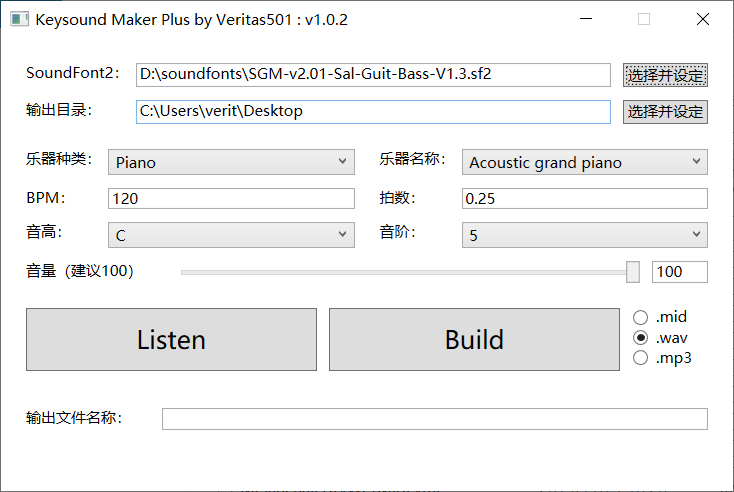

# Keysound Maker Plus
Yet another keysound maker for making beatmap hitsound :)

Similar to [dudehacker's keysound maker](https://osu.ppy.sh/community/forums/topics/488175), but with some new features and bug fixing.

- Keysound is generated from soundfont file, sound quality is much better.
- By using different soundfont, you can generate even 8bit retro keysound.
- Fix the bug that can't generate drum sound.
- You can generate different format keysound file.

---

和[dudehacker的Keysound Maker](https://osu.ppy.sh/community/forums/topics/488175)类似，但新增了一些特色以及做了bug修复。

- keysound通过soundfont音色库文件生成，更好的音色库能够带来明显的音质提升
- 使用不同的soundfont可以方便做出8bit的音色
- 修复了之前不能生成鼓点的bug
- 可以生成不同的常用文件格式

## Interface (界面)

## Download (下载)

https://github.com/veritas501/Keysound-Maker-Plus/releases

## Some useful soundfont2 (一些常用的soundfont)

- https://sites.google.com/site/soundfonts4u/
  - [Nice-Keys-Ultimate-V2.3](https://drive.google.com/file/d/0B3zFERJ2rMQpeDF3cTBlQWJXdHc/view?usp=sharing)
  - [SGMv2.01-Sal-Guit-Bass-V1.3](https://drive.google.com/file/d/1HV8L5FdX5xZDqpJ83UCaoWPaHFQrLKHj/view?usp=sharing) (Recommend 推荐)
- https://musical-artifacts.com/
  - [8bitSF ( The Nes Soundfont )](https://musical-artifacts.com/artifacts/23)

- 短歌行
- FluidR3

